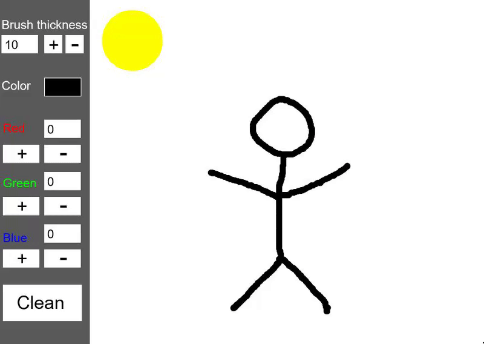
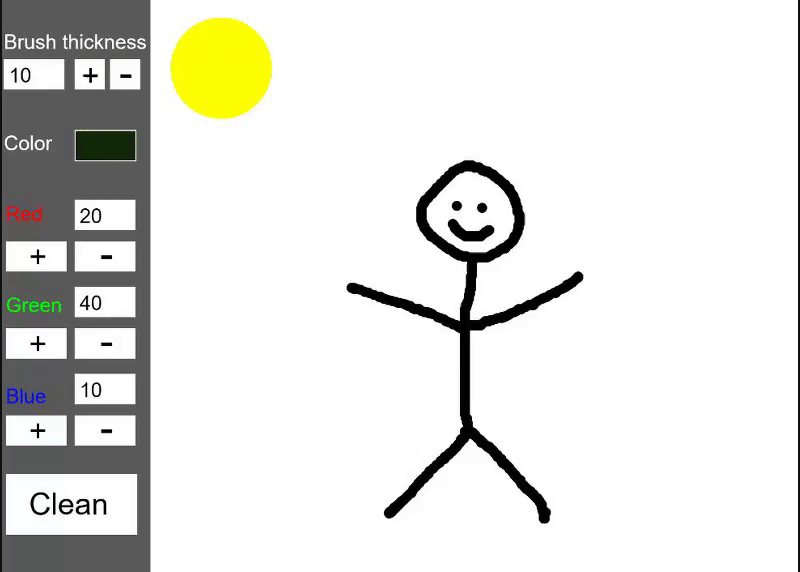

# Paint
Paint prototype using p5.js

  - You can paint on the right side of the screen by holding down any mouse button and dragging it.

  - Change brush thickness pressing '+' and '-' buttons with mouse.
  - You can also change the thickness of the brush by placing the cursor over the buttons and moving the mouse wheel.
  - As with the brush, you can change the RGB colors with the buttons and the mouse wheel.
  - Press 'Clean' button to clean the screen.
  

## Referencies

[p5.js](https://p5js.org/reference/)
